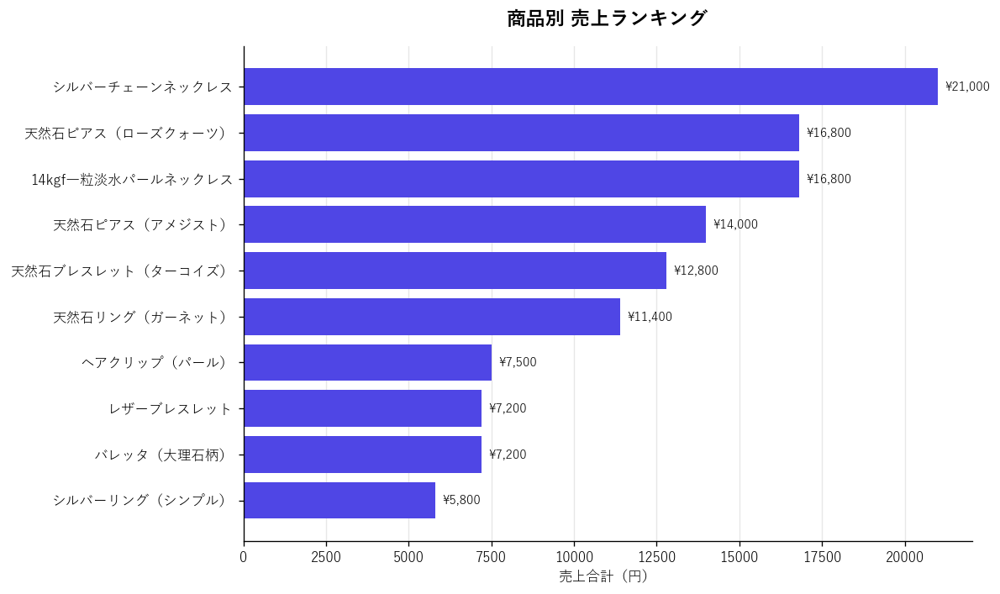
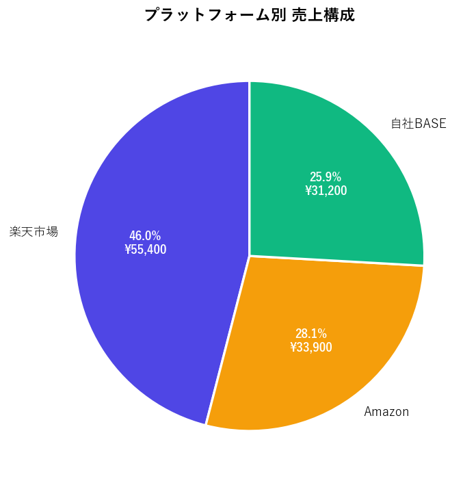
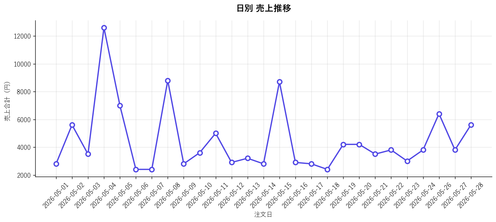

# EC事業者向け 受注データ統合・集計ツール

複数のECプラットフォーム（楽天市場・Amazon・自社BASE）から出力される受注CSVを、**1コマンドで統合・集計・グラフ化**してExcelで出力するPythonスクリプトです。

> 「**月末の集計作業 2時間 → 数秒**」を実現。

---

## 📊 出力サンプル（このページ内で全部見られます）

サンプル受注データ33件を実行した結果です。完全版は [sample_output.xlsx](sample_output.xlsx) からダウンロードできます。

### 商品別 売上ランキング

| 商品名               |   注文件数 |   販売個数 | 売上合計    |
|:------------------|-------:|-------:|:--------|
| シルバーチェーンネックレス     |      4 |      6 | ¥21,000 |
| 14kgf一粒淡水パールネックレス |      4 |      4 | ¥16,800 |
| 天然石ピアス（ローズクォーツ）   |      5 |      6 | ¥16,800 |
| 天然石ピアス（アメジスト）     |      4 |      5 | ¥14,000 |
| 天然石ブレスレット（ターコイズ）  |      3 |      4 | ¥12,800 |
| 天然石リング（ガーネット）     |      3 |      3 | ¥11,400 |
| ヘアクリップ（パール）       |      2 |      5 | ¥7,500  |
| バレッタ（大理石柄）        |      3 |      4 | ¥7,200  |
| レザーブレスレット         |      3 |      3 | ¥7,200  |
| シルバーリング（シンプル）     |      2 |      2 | ¥5,800  |



### プラットフォーム別 売上構成

| プラットフォーム   |   注文件数 |   販売個数 | 売上合計    | 売上構成比 |
|:-----------|-------:|-------:|:--------|:------|
| 楽天市場       |     15 |     20 | ¥55,400 | 46.0% |
| Amazon     |     10 |     12 | ¥33,900 | 28.1% |
| 自社BASE     |      8 |     10 | ¥31,200 | 25.9% |



### 日別 売上推移



### 合計

- **総注文数**: 33 件
- **総販売個数**: 42 個
- **売上合計**: **¥120,500**

---

## 想定するお客さま

**副業でEC運営をしている個人事業主さま**を想定して設計しています。

たとえばこんな方：

> **田中 真奈美さん（32歳・東京都内在住）**
> 本業はWebデザイナー（会社員）。副業でハンドメイドアクセサリーを販売している副業EC事業者。
> 販売チャネルは「楽天市場」「Amazon」「自社BASEショップ」の3つ。

### 田中さんの「月末のあるある」

毎月末、各プラットフォームから受注CSVをダウンロードしてExcelで開く。**でも3つのCSVは列名が全然違う：**

| 楽天市場 | Amazon | 自社BASE |
|---|---|---|
| `注文日` | `purchase-date` | `order_date` |
| `商品名` | `product-name` | `item_name` |
| `個数` | `quantity` | `qty` |
| `金額` | `item-total` | `total_price` |

しかもAmazonは商品名が英語表記。「Natural Stone Pierced Earrings Rose Quartz」が「天然石ピアス（ローズクォーツ）」と同じ商品だと、人間が見て判断する必要がある。

結果：
- 列名を手作業で揃える
- Amazonの英語商品名を日本語商品名に1つずつ置き換える
- 3つのCSVをコピペで1枚に統合
- 商品別に並び替え、SUM関数で集計
- グラフを作る

**毎月の所要時間: 約2時間。**

> 「副業のはずなのに、月末の集計作業が一番しんどい…」

---

## このツールが提供する価値

### Beforeとの比較

| 項目 | Before（手作業） | After（ツール導入） |
|---|---|---|
| 所要時間 | 約2時間/月 | **約5秒/月** |
| 作業内容 | 列名統一・コピペ・関数・グラフ | コマンド1回 |
| ミス | コピペミス・関数の打ち間違いあり | ほぼゼロ |
| 確定申告の準備 | 別途まとめ直し | **出力ファイルがそのまま使える** |

### 金額に換算した価値

| 項目 | 金額 |
|---|---|
| 削減時間 | 月2時間 × 12ヶ月 = **年24時間** |
| 機会費用（時給3,000円換算）※ | **年72,000円相当** |
| 想定導入費 | 2〜3万円 |
| 回収期間 | **約4〜6ヶ月** |

※ 田中さんの本業はWebデザイナー（時給目安3,000円）のため、副業の集計に使っていた2時間を本業に充てた場合の機会損失。

### 副次的なメリット: 確定申告がラクになる

副業で年間20万円以上の所得がある場合、**確定申告が必要**です。
本ツールが生成するExcelには：

- **全プラットフォームの売上が1枚に統合**されている
- どの注文がどのプラットフォーム由来かを `プラットフォーム` 列で追跡可能
- 商品別・日別の集計シート付き

→ そのまま確定申告の売上資料として使えます。税理士に渡す前のまとめ作業も不要。

---

## 使い方

### セットアップ

```bash
# 仮想環境を作る（推奨）
python -m venv .venv
.venv\Scripts\activate     # Windows
# source .venv/bin/activate  # macOS / Linux

# 依存パッケージをインストール
pip install -r requirements.txt
```

### ファイル名のルール

入力フォルダに置くCSVのファイル名は、**先頭でプラットフォームを識別**できる形にしてください（プレフィックスは `config.json` で変更可能）：

| プラットフォーム | ファイル名の例 |
|---|---|
| 楽天市場 | `rakuten_orders_202605.csv` |
| Amazon | `amazon_orders_202605.csv` |
| 自社BASE | `base_orders_202605.csv` |

### 実行

```bash
# 標準実行（config.json を自動で読み込み）
python merge_reports.py ./sample_data ./output.xlsx

# 別の設定ファイルを使いたい場合
python merge_reports.py ./sample_data ./output.xlsx --config client_a_config.json
```

実行すると、ターミナルに進行状況と集計サマリーが表示されます：

```
[0/5] 設定ファイル読み込み: config.json
  対応プラットフォーム: ['rakuten', 'amazon', 'base']
[1/5] ファイル読み込み: sample_data
  読み込み: amazon_orders_202605.csv → Amazon として処理
  読み込み: base_orders_202605.csv → 自社BASE として処理
  読み込み: rakuten_orders_202605.csv → 楽天市場 として処理
  → 合計 33 行
[2/5] データクリーニング
[3/5] 集計シート生成
[4/5] Excel出力: output.xlsx
[5/5] 完了！

==================================================
[集計サマリー]
==================================================
  総注文数:   33 件
  総販売個数: 42 個
  売上合計:   ¥120,500

  プラットフォーム別:
    楽天市場        15件 / ¥  55,400 (46.0%)
    Amazon      10件 / ¥  33,900 (28.1%)
    自社BASE       8件 / ¥  31,200 (25.9%)

  売上TOP3:
    1. シルバーチェーンネックレス                  ¥ 21,000
    2. 14kgf一粒淡水パールネックレス              ¥ 16,800
    3. 天然石ピアス（ローズクォーツ）                ¥ 16,800
==================================================
```

---

## 出力されるExcelの構成

| シート名 | 内容 |
|---|---|
| **全注文** | 3プラットフォーム全部を統一スキーマで縦結合した完全データ。`プラットフォーム`列で由来を追跡可能。 |
| **商品別集計** | 商品ごとの注文件数・販売個数・売上合計。**売上が高い順に自動ソート**。横棒グラフ付き。 |
| **プラットフォーム別集計** | プラットフォームごとの売上と構成比（%）。 |
| **日別売上推移** | 注文日ごとの売上推移。**折れ線グラフ付き**。 |

---

## 🔧 設定ファイルでカスタマイズ可能

このツールの**柔軟性のポイント**は、列名のマッピングや商品名の変換ルールを **`config.json` という設定ファイル**で外部化していること。**コードを書き換えなくても、JSON を編集するだけで** 様々なCSV形式に対応できます。

### config.json の構造

```json
{
  "platforms": {
    "rakuten": {
      "filename_prefix": "rakuten",
      "label": "楽天市場",
      "columns": {
        "注文番号": "注文番号",
        "注文日": "注文日",
        "商品名": "商品名",
        "個数": "個数",
        "金額": "金額"
      }
    },
    "amazon": {
      "filename_prefix": "amazon",
      "label": "Amazon",
      "columns": {
        "order-id": "注文番号",
        "purchase-date": "注文日",
        ...
      },
      "product_name_translation": {
        "Silver Chain Necklace": "シルバーチェーンネックレス",
        ...
      }
    }
  }
}
```

### こんな時に config.json を編集すれば対応できます

| シーン | 対応方法 |
|---|---|
| 「うちの楽天CSVは`金額`じゃなく`合計金額`」 | `"合計金額": "金額"` に書き換え |
| 「Amazonの商品名翻訳テーブルを増やしたい」 | `product_name_translation` に追加 |
| 「Yahoo!ショッピングのCSVも対応したい」 | `"yahoo": { ... }` ブロックを丸ごと追加 |
| 「テスト用に別の設定で動かしたい」 | `--config my_test.json` で別ファイルを指定 |

### 複数の設定を使い分けたいとき

```bash
# デフォルト（config.json）
python merge_reports.py ./data ./output.xlsx

# クライアントAの設定ファイルを使う
python merge_reports.py ./data ./output.xlsx --config client_a_config.json
```

→ 1つのツールで複数クライアントの異なるCSV形式に対応可能。

---

## 技術的なポイント

### 設定駆動アーキテクチャ

列名のマッピングと商品名翻訳テーブルを `config.json` から動的に読み込むことで、コード変更ゼロで形式の異なるCSVに対応できる設計に。新しいプラットフォームを追加する場合も、JSONに1ブロック追加するだけで完結。

### Amazonの英語商品名 → 日本語への自動変換

Amazonは国際SKUの関係で商品名が英語になりがち。商品別に集計するには日本語名と統一する必要があるため、`product_name_translation` 辞書を使って吸収。クライアントの商品ラインナップに応じて、この辞書もJSONで自由に拡張可能。

### 重複注文の自動削除

同じ月内のCSVを誤って2回エクスポートしてしまった場合などに備え、`注文番号`をキーに重複を自動削除します。

### ファイル名先頭でプラットフォーム自動判別

`rakuten_*.csv`、`amazon_*.csv` のように、ファイル名の prefix で形式を判別。手動でプラットフォームを指定する必要なし。`filename_prefix` も config.json で変更可能（例: `r_*.csv` のような短縮名にも対応可）。

---

## カスタマイズ提供（有料）

以下のような追加対応もご相談ください：

- **新しいプラットフォーム対応**: Yahoo!ショッピング、minne、Creema、Shopify等（+5,000円〜）
- **税抜き／税込みの自動換算**: 軽減税率にも対応（+3,000円）
- **顧客別の分析**: リピート率や顧客生涯価値（LTV）の算出（+10,000円〜）
- **クラウドストレージ連携**: Google Drive / Dropbox から自動でCSVを取得（+15,000円〜）
- **定期実行の自動化**: Windowsタスクスケジューラ / cron で月末自動レポート生成（+5,000円〜）
- **出力フォーマットのカスタマイズ**: 会社のロゴ追加、色味変更、PDF同時出力など

---

## 技術スタック

- Python 3.10+
- pandas（データ統合・集計）
- openpyxl（Excel出力・グラフ・スタイリング）

---

## サンプルデータと出力例

`sample_data/` フォルダには、田中さんの2026年5月分の架空受注データを置いてあります（33件分）：

- `rakuten_orders_202605.csv` — 楽天市場 15件
- `amazon_orders_202605.csv` — Amazon 10件
- `base_orders_202605.csv` — 自社BASE 8件

このサンプルを使った実行結果は **`sample_output.xlsx`** として同梱しています。スクリプトを動かさなくても、ExcelやGoogleスプレッドシートで開くだけで「どんなレポートが生成されるか」を確認できます。

ご自身のCSVに差し替えてご利用ください。
